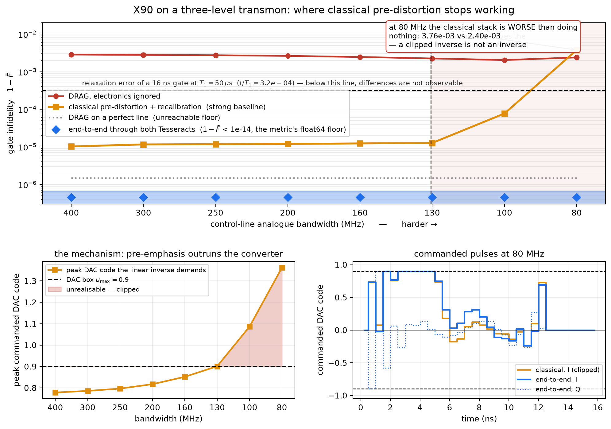
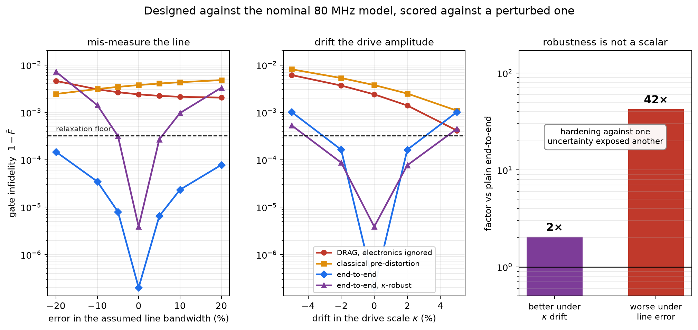

# Pre-distortion by composition

**Designing a transmon X90 gate through a Julia instrument model and a JAX propagator, with one gradient.**

**Track 03 — Hybrid ML + mechanistic models.** ·
[github.com/Oishi1029/predistort](https://github.com/Oishi1029/predistort) · Apache-2.0 · solo entry

---

## 1. The problem

The pulse you design is not the pulse the qubit receives. Between them sit a DAC holding samples at
2 GSa/s, a baseband line with a few hundred MHz of bandwidth, an IQ mixer with a percent of gain
imbalance and a degree of quadrature skew, and an output amplifier that compresses near full scale.

There is a particular cruelty in how this meets the standard solution. A transmon is weakly
anharmonic, so a short pulse leaks population into $|2\rangle$. The textbook fix is DRAG: add a
quadrature component proportional to the *derivative* of the in-phase envelope. But a derivative is
exactly the high-frequency content a band-limited line destroys. **The standard leakage fix is
specifically the thing the electronics break.**

So stop treating the instrument as an error to correct afterwards, and differentiate through it.

## 2. Composition across a real boundary

```
theta ─► u = u_max·tanh(theta), masked to a 12 ns support   (32 DAC codes/quadrature)
            │
            ▼   Tesseract A — electronics      JULIA core, hand-derived analytic adjoint,
            │                                  no AD framework in the image
            │   256 samples/quadrature @ 16 GSa/s
            ▼   Tesseract B — transmon         JAX autodiff, three levels, Taylor propagator
            │
            ▼   virtual-Z-optimal gate infidelity
```

One `jax.grad` runs from the infidelity, back through the JAX propagator, across an HTTP boundary,
into a Julia analytic adjoint, and out onto the DAC codes. The boundary is **both** kinds the
organisers name: *language* and *differentiation strategy*.

**Verified against finite differences taken through both containers**, so the check exercises the
whole chain rather than either half:

| check | result |
|---|---|
| composed gradient, worst coordinate-wise rel. error | **1.14e-06** |
| composed gradient, random direction | **1.64e-08** |
| Julia adjoint alone, dot-product identity $\langle \bar y, Jv\rangle$ vs $\langle J^{\mathsf T}\bar y, v\rangle$ | **1.7e-15** |
| `check-gradients`, both containers, 3 endpoints each, `rtol 0.02` | **0 failures / 2000** each |
| virtual-Z invariance of the metric, 13 angles | **0.000e+00** |

## 3. Why this genuinely needs Tesseract

The honest objection to any two-container differentiable pipeline is `jax.custom_vjp` — the
decorator that exists precisely to attach a hand-written backward pass to a function JAX cannot
differentiate. If component A were NumPy, a competent JAX programmer would paste the adjoint under
that decorator, delete both Dockerfiles, save four HTTP round-trips per iteration, and get
bit-identical gradients. The containers would be decoration.

**Component A is not Python.** Its core and its derivatives are a Julia module. Collapsing this into
one process means embedding a Julia runtime inside the JAX process — two garbage collectors, two
package managers, two threading models, a multi-second interpreter start per launch. Nobody makes
that trade for a component that is called over a socket perfectly well.

**The image forbids autodiff.** The build *fails* if `jax`, `torch`, `tensorflow` or `autograd` can
be imported inside the electronics container. The claim is enforced, not asserted.

**The chain is genuinely nonlinear**, so there is no fixed Jacobian to precompute and fold into JAX
as a matmul. Measured homogeneity violation $\|f(2u)-2f(u)\|_\infty = 0.173$; any linear chain gives
exactly zero.

## 4. The result is a threshold, not a ratio

The optimiser controls 64 parameters, 48 of them free inside the drive support. Amplitude limits are
structural rather than penalties — $u = u_{\max}\tanh\theta$, $u_{\max}=0.90$ — and the first and
last samples are pinned to zero because a real AWG waveform must start and end there.

**The baseline is deliberately strong.** It gets every correction a competent engineer applies
before reaching for gradients: exact inversion of the affine IQ mixer including LO-leakage nulling,
closed-form memoryless AM/AM pre-distortion of the Rapp compressor, Tikhonov-regularised inversion
of the measured LTI line response, and recalibration of amplitude, drive phase and DRAG
coefficient — all fitted through the true chain and scored with the same metric.

A single headline ratio would invite the fair question *"did you pick the regime that flattered
you?"* — and we hit a sharper version of that problem: at a comfortable 250 MHz line the classical
baseline already reaches 1.18e-5, about thirty times **below** the relaxation error a 16 ns gate
suffers at $T_1 = 50\,\mu$s ($t/T_1 = 3.2\times10^{-4}$). The improvement there is real and
physically unobservable. So the result is a sweep over the axis that genuinely varies between
fridges: the analogue bandwidth of the control line.



| line BW (MHz) | naive | classical | end-to-end | DAC code the inverse demands |
|---:|---:|---:|---:|---:|
| 400 | 2.86e-3 | 1.03e-5 | < 1e-14 | 0.778 |
| 250 | 2.74e-3 | 1.18e-5 | < 1e-14 | 0.797 |
| 160 | 2.46e-3 | 1.23e-5 | < 1e-14 | 0.852 |
| 130 | 2.25e-3 | 1.27e-5 | < 1e-14 | 0.901 ← box exceeded |
| 100 | 2.04e-3 | 7.71e-5 | < 1e-14 | 1.086 |
| 80 | 2.40e-3 | **3.76e-3** | < 1e-14 | 1.362 |

**The threshold is at ≈131 MHz and it lands where the mechanism predicts.** Inverting a low-pass
line means boosting high-frequency content, so a narrower line makes pre-emphasis demand larger DAC
codes. Once they leave the box they are clipped, and *a clipped inverse is not an inverse*.
End-to-end optimisation has no such failure mode because the box lives inside its parameterisation.

Above the threshold the classical stack is excellent and **this method is unnecessary** — we say so
plainly. Below it, the classical stack does not degrade gracefully toward doing nothing; at 80 MHz
it reaches 3.76e-3, **worse than applying no pre-distortion at all** (2.40e-3), because the pulse it
produces is neither the intended one nor the uncorrected one. End-to-end reaches the metric's
float64 floor at every point, in 19–68 objective evaluations.

*End-to-end is reported as a bound, never a value.* It returns between $-2\times10^{-15}$ and
$+5\times10^{-15}$ — rounding noise about zero. **No ratio against it is quoted anywhere.**

## 5. Is the aggressive solution fragile? Measured, not asserted

The 80 MHz solution sits at the DAC rail for five consecutive samples. A waveform that extreme
*ought* to be sensitive to error in the model it was designed against, so every arm was designed
against the nominal model and scored against a perturbed one.



**It tolerates a mis-measured line.** At ±20% bandwidth error it degrades to 1.5e-4 — still 16×
better than the classical stack and at or below the relaxation floor.

**It is sensitive to drive-amplitude drift**, the one parameter a lab cannot hold: 5% error in
$\kappa$ costs 1.0e-3. The fix needs no structural change — keep the same two Tesseracts, evaluate
the loss at several $\kappa$, average, and let the gradient flow through every ensemble member:

| | end-to-end | $\kappa$-robust |
|---|---:|---:|
| nominal | < 1e-14 | 3.87e-6 |
| $\kappa$ ±5% | 1.02e-3 | **≈2× better** |
| line BW ±20% | ~1e-4 | **≈42× worse** |

**Robustness is not a scalar, and this is the most useful negative result here.** Hardening against
drive drift did exactly what it was asked, and traded away a factor of forty in tolerance to
line-model error — the ensemble pushed the optimiser into a corner far more exposed to the parameter
it was not told to worry about. The correct response is to put both uncertainties in the ensemble,
which this composition supports unmodified. **That is not done here**, and no jointly-robust claim
is made.

## 6. Two things that were nearly wrong

**The propagator.** Building it with `eigh` is the obvious choice and it is silently wrong: the
eigendecomposition derivative carries $1/(w_i-w_j)$ terms, and the drift Hamiltonian is degenerate
at zero drive — so the VJP is NaN at exactly the samples where a real AWG waveform must start and
end, while the forward pass looks perfect. Measured: **2 NaNs with `eigh`, 0 with a fixed-order
Taylor exponential** (order 12, truncation 6.9e-13, full-gate unitarity 3.8e-11).

**The metric.** Labs implement Z rotations by relabelling later pulse phases, free and
instantaneous, so a figure of merit that charges for Z error reports an error the lab never suffers
and flatters whichever arm happened to drift least. Fidelity is therefore maximised in closed form
over a free virtual Z: with $c = \mathrm{diag}(M M_{\text{target}}^\dagger)$, the overlap
$|c_0 + e^{-i\varphi}c_1|$ is maximised at $|c_0|+|c_1|$ — no search, still differentiable.

## 7. The adjoint

Component A's derivatives are all derived on paper; the full derivation is the module docstring of
[`julia/src/LineChain.jl`](tesseracts/electronics/julia/src/LineChain.jl). The three that matter:

- **A causal LTI filter** with zero initial state is a lower-triangular Toeplitz matrix $H$, so
  $(H^{\mathsf T}v)[n] = \sum_{m\ge n} h[m-n]v[m]$ — *the adjoint of a causal filter is the same
  filter run on the time-reversed signal, reversed back.* A biquad cascade is itself LTI, so this
  handles the whole cascade at once. Exact, not an approximation.
- **The Rapp compressor** acts on the envelope magnitude, so its Jacobian is *not* diagonal — the
  gain on $I$ depends on $Q$. With $h(r)\equiv g'(r)/r$ written in closed form so $r=0$ is never a
  numerically-evaluated removable singularity, it is
  $g(r)\,\mathbb 1 + h(r)\,[\,I^2\ IQ;\ IQ\ Q^2\,]$ — symmetric, so forward and reverse mode share
  one expression.
- **The zero-order hold** fans each input to $U$ outputs, so its adjoint sums cotangents per block.

## 8. Reproducibility

`make env && make build && make verify && make reproduce`, all on a laptop CPU. Julia is not needed
on the host — 1.12.6 aarch64 is baked into the electronics image, precompiled into a layer, with a
committed `Manifest.toml`. Seeds fixed; `results/*.json` committed. Transport costs 11 ms per
`apply` and 26 ms per gradient call, so one optimiser step through both containers is 60–70 ms.

Two traps cost real time and are documented in the README: colima only mounts `$HOME`, so
Tesseract's default `tempfile.mkdtemp()` output directory bind-mounts as a root-owned empty
directory and every `apply` dies with `PermissionError`; and `docker buildx` is required but is not
installed alongside Docker via Homebrew. A third is worth stating for anyone building a JAX
Tesseract: the container must `jax.jit` its own hot path — leaving it eager cost **575.6 ms vs
4.7 ms** per value+grad here, a 123× difference that turned a 4-minute sweep into 45 minutes.

Built for arm64; an amd64 build path is documented.

## 9. Disclosure

Built solo with AI-assisted development (Anthropic Claude) for code generation, drafting and
documentation. The problem framing, composition design, gradient verification and all reported
results are my own and were validated by me.
